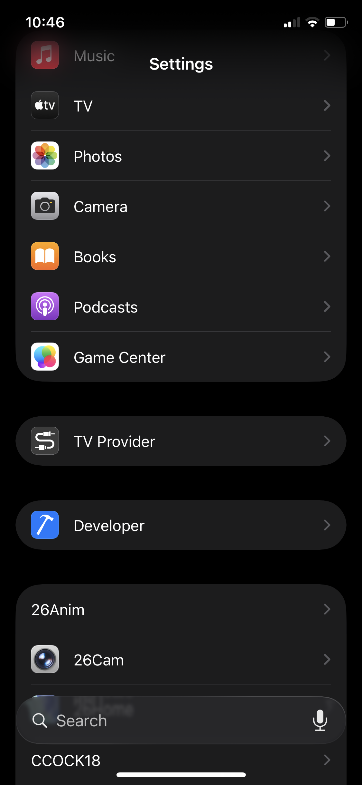
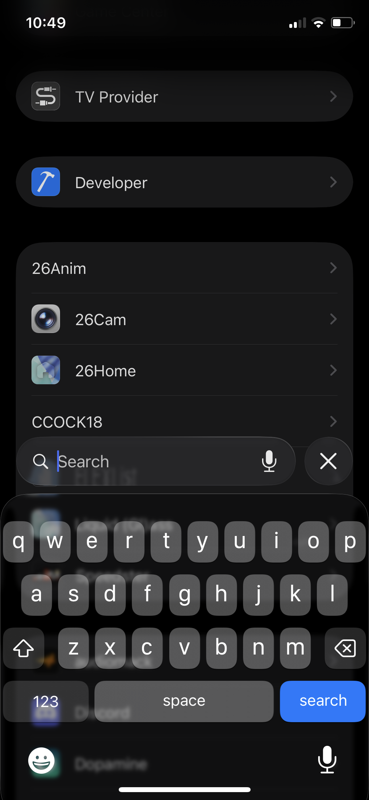
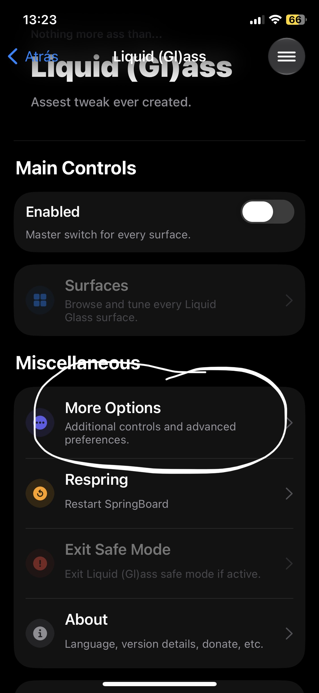
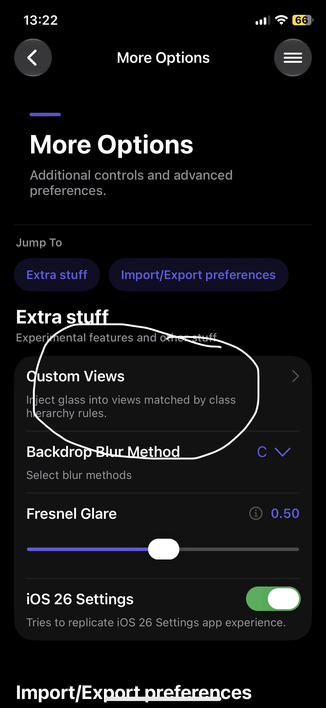
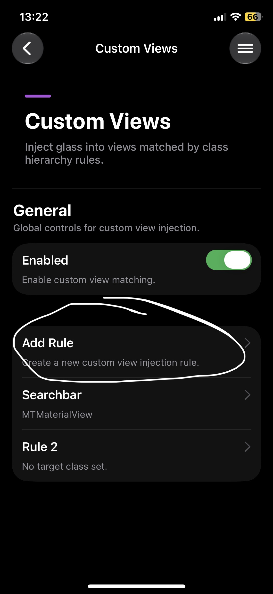
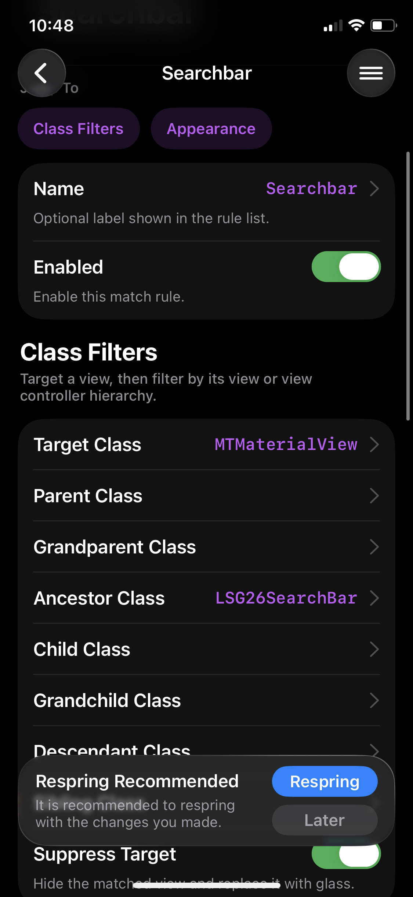
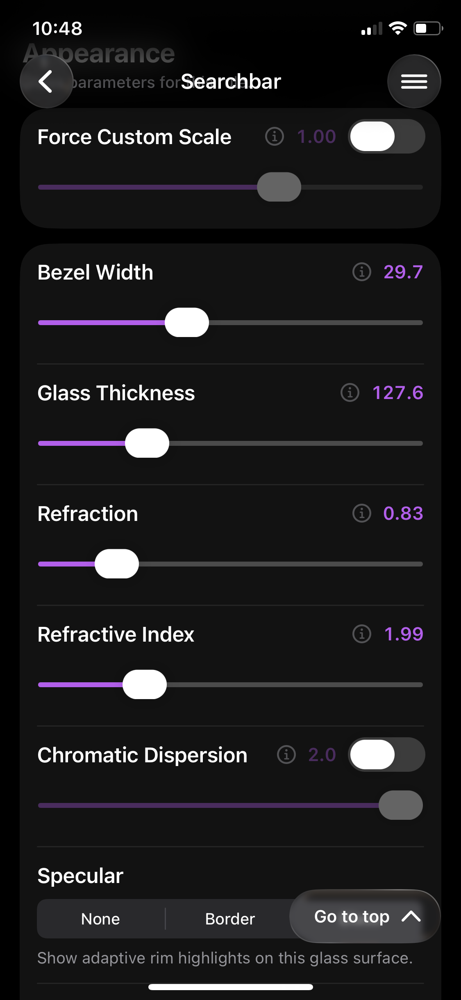
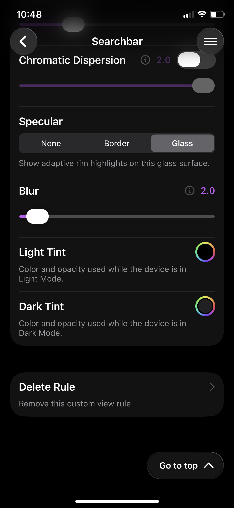
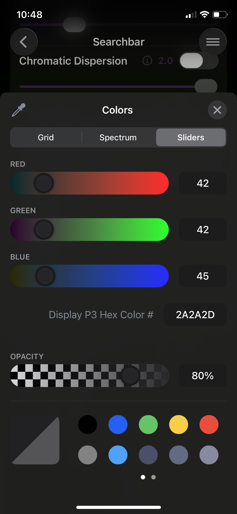

# BlurSearch 🔍✨

**BlurSearch** is an iOS tweak that brings the new Settings search bar from iOS 26 to older iOS versions; it currently supports iOS 15 and iOS 16.

It uses the native iOS 16 SpringBoard dock blur effect!

---

## 📸 Screenshots

| | |
| :---: | :---: |
|  |  |

---

## 🧪 Liquid Glass Integration

If you want to use the **Liquid Glass** effect, you need to install the **Liquid gl(ass)** tweak made by **Winaviation** and follow this guide:

| Step 1 | Step 2 | Step 3 |
| :---: | :---: | :---: |
|  |  |  |

| Step 4 | Step 5 | Step 6 |
| :---: | :---: | :---: |
|  |  |  |

| Step 7 |
| :---: |
|  |

---

## 🛠️ Installation

1. Add my repository to your package manager:
   ```text
   coming soon
